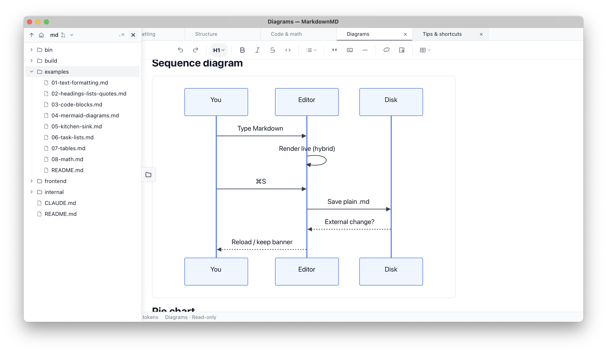

# MarkdownMD

I loved [MarkText](https://github.com/marktext/marktext) (especially the hybrid WYSIWYG / source editing) and [Typora](https://typora.io). I worked with Claude to design and build something like it on more modern foundations ([TipTap](https://tiptap.dev) + [Wails 3](https://v3.wails.io)).

With the increased use of AI in my development work I’m finding myself reading and reviewing more and more markdown files and wanted something more suited for my use case.



## Open core

MarkdownMD is open core.

This repository contains the open-source core editor. It builds and runs standalone without the private `md-pro` repository, and the OSS features can be used, modified, built, and redistributed under the open-source license below.

Official release binaries may include non-OSS features from the private `md-pro` repository. Those binaries are currently free to use and include a time-limited preview: non-OSS features deactivate 90 days after the release date unless otherwise licensed. Open-source features continue to work after that period.

| Feature | OSS source build | Official release binary |
| --- | --- | --- |
| Core markdown editor | Yes | Yes |
| File explorer and local editing | Yes | Yes |
| External file reload | Yes | Yes |
| Dirty changed-on-disk banner | Yes | Yes |
| Disk-vs-working visual diff | No | Pro preview, 90 days |
| Change History | No | Pro preview, 90 days |

## Develop

```
wails3 dev
```

## Build

```
wails3 task darwin:package           # macOS .app in bin/
wails3 task darwin:package:universal # universal binary
wails3 task windows:package          # Windows .exe
wails3 task linux:package            # Linux AppImage / .deb / .rpm
```

## System requirements

- **macOS:** 11 (Big Sur) or later, Apple Silicon.
- **Windows:** Windows 10 or later (WebView2 runtime; bundled by the installer).
- **Linux:** A distribution shipping **GTK 4 + WebKitGTK 6.0 and glibc 2.38+** — e.g. **Ubuntu 24.04 / Linux Mint 22 / Debian 13** or newer. The Linux build links against the GTK4/WebKitGTK6 stack, which is not packaged on older releases (Ubuntu 22.04 / Mint 21 ship glibc 2.35 and only WebKit2GTK 4.1), so the AppImage will not run there. Older distros need to upgrade.

## License

The open-source core in this repository is dual-licensed under either:

- Apache License, Version 2.0 ([LICENSE-APACHE](LICENSE-APACHE))
- MIT license ([LICENSE-MIT](LICENSE-MIT))

at your option.

Pro features included in official release binaries are not part of this Apache-2.0/MIT codebase.
