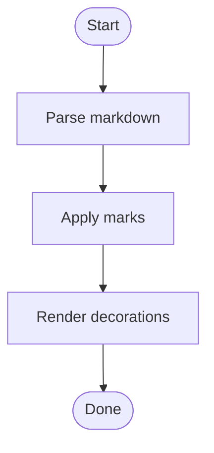
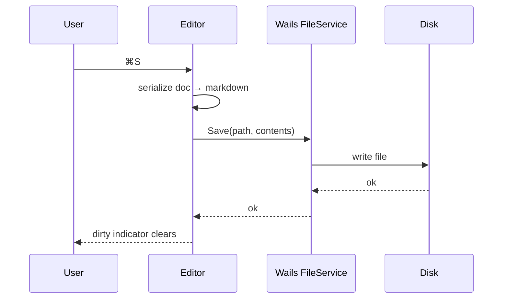
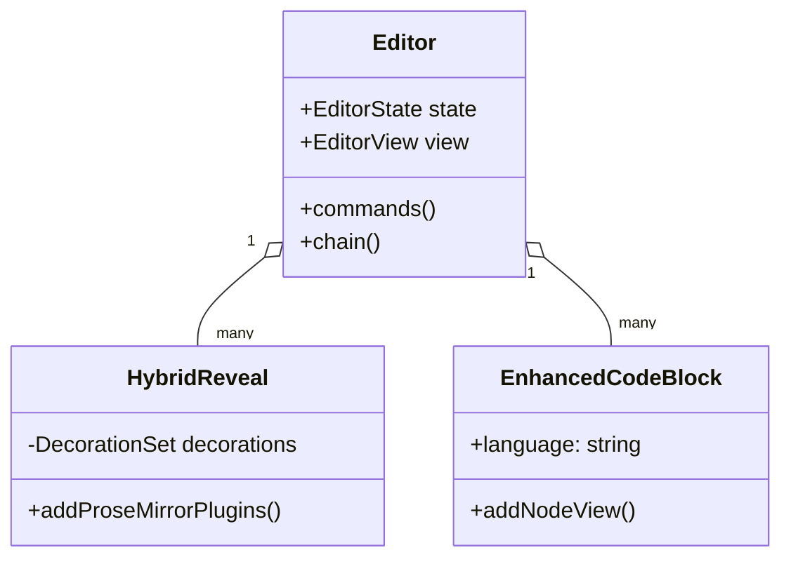
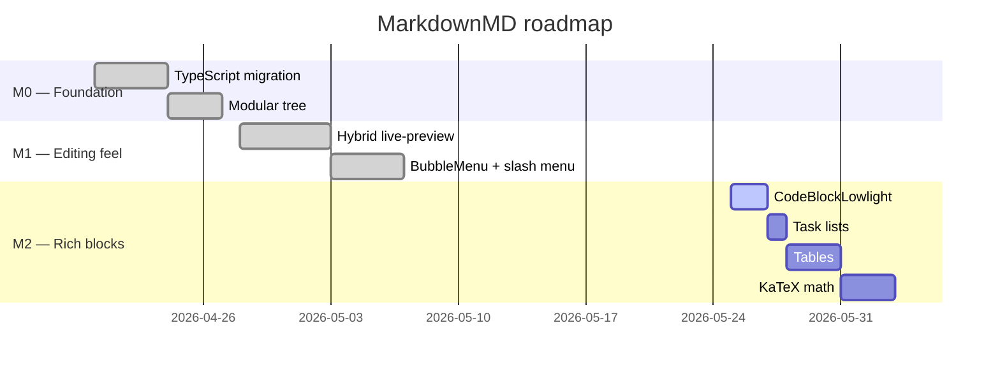
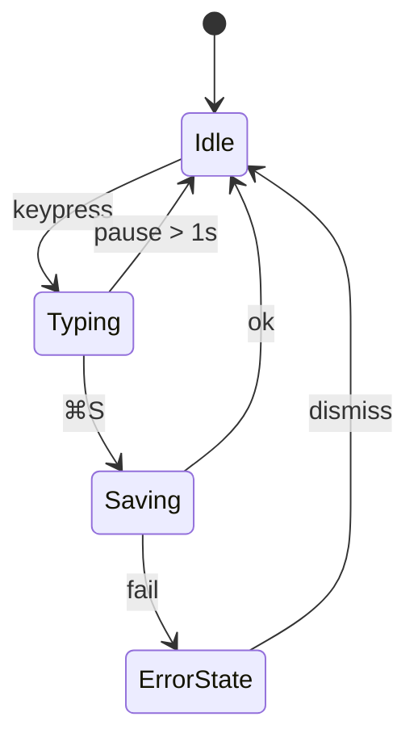
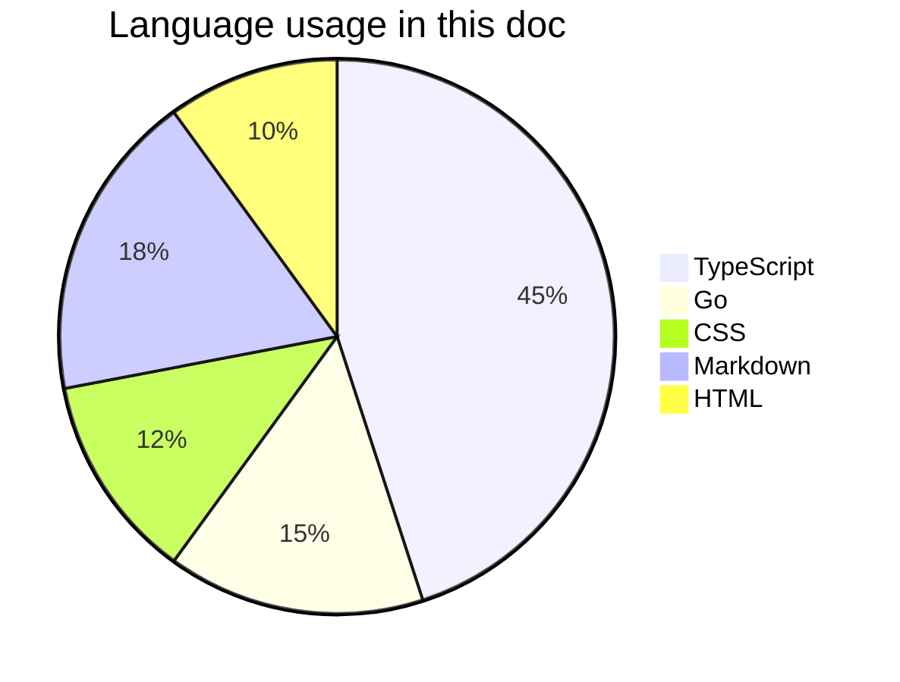

# Mermaid diagrams

Code blocks tagged with the `mermaid` language render as live SVG diagrams via [mermaid.js](https://mermaid.js.org/). Click into the block to edit; the preview updates after a short debounce.

## Flowchart

## Sequence diagram

## Class diagram

## Gantt chart

## State diagram

## Pie chart

## What to try

- Click into the source of any mermaid block — you'll see the raw mermaid text; the rendered diagram stays above it.
- Edit the text and pause typing — the preview re-renders after ~350ms.
- A syntax error shows an inline red error banner instead of crashing the editor.
- Use the language chip to switch a regular code block to "Mermaid" and watch it activate.
