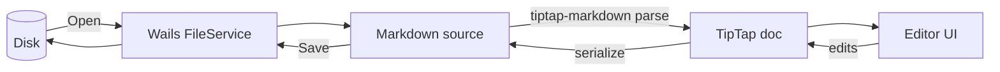

# Kitchen sink

Every feature in a single document — useful as a markdown round-trip stress test. Save (`⌘S`), reopen, and the document should come back byte-identical (modulo trailing newline normalisation).

## A recipe-shaped document

A weekend project that grew bigger than expected, told in **the format the editor supports today**.

> "The plan was to spend an afternoon. The afternoon was four weeks ago." — _someone, probably_

### Ingredients

1. One **TipTap editor**, freshly modularized.
2. A pinch of `prosemirror-view` decorations.
3. ~~A lot of vanilla JS~~ → migrated to TypeScript.
4. Live syntax highlighting via [lowlight](https://github.com/wooorm/lowlight).
5. A diagram engine — [mermaid.js](https://mermaid.js.org/).

### Step 1 — initialize the editor

```typescript
import { Editor } from '@tiptap/core'
import StarterKit from '@tiptap/starter-kit'
import { EnhancedCodeBlock } from './extensions/CodeBlock'
import { lowlight } from './extensions/lowlight'

const editor = new Editor({
  element: document.querySelector('#editor')!,
  extensions: [
    StarterKit.configure({ codeBlock: false }),
    EnhancedCodeBlock.configure({ lowlight, defaultLanguage: null }),
  ],
})
```

### Step 2 — wire the data flow



### Step 3 — light a candle for the test pyramid

> Type-check passes, build:dev passes, and you should always be able to round-trip a `.md` file through Open → Save without surprise reflows.

### Selected commands

| Action                | Shortcut       |
| --------------------- | -------------- |
| Bold                  | `⌘B`           |
| Italic                | `⌘I`           |
| Inline code           | `⌘E`           |
| Link (with selection) | `⌘K`           |
| Cycle heading forward | `⌘]`           |
| Cycle heading back    | `⌘[`           |
| Set H1 / H2 / H3      | `⌘⌥1/2/3`      |
| Slash menu            | `/`            |

_Tables themselves aren't a TipTap node yet — the row above is rendered as a plain markdown table by the StarterKit's text parser. Native table editing arrives in **M2.3**._

### Notes from the build log

```bash
$ npm run typecheck
> tsc --noEmit
✓ no errors

$ npm run build:dev
✓ built in 3.76s
```

A small `JSON` summary of where things stand:

```json
{
  "milestones": {
    "M0": "foundation — done",
    "M1": "editing feel — done",
    "M2": "rich blocks — in progress",
    "M3": "app shell — todo",
    "M4": "polish — todo"
  }
}
```

---

### Inline trivia

- _Italic_ next to **bold** next to ~~strike~~ next to `code`, then a [link](https://example.com).
- Nested emphasis: **bold containing _italic with `code` inside_**.
- A blockquote can hold a fenced block:

> Quoted prose, and then:
>
> ```bash
> echo "yes, this works"
> ```

---

## What to try

1. Click into each block — markers reveal on the active block only.
2. Save with `⌘S`, close the file, reopen — every block should look the same.
3. Open `03-code-blocks.md` next to this in a separate window to compare language highlighting.
