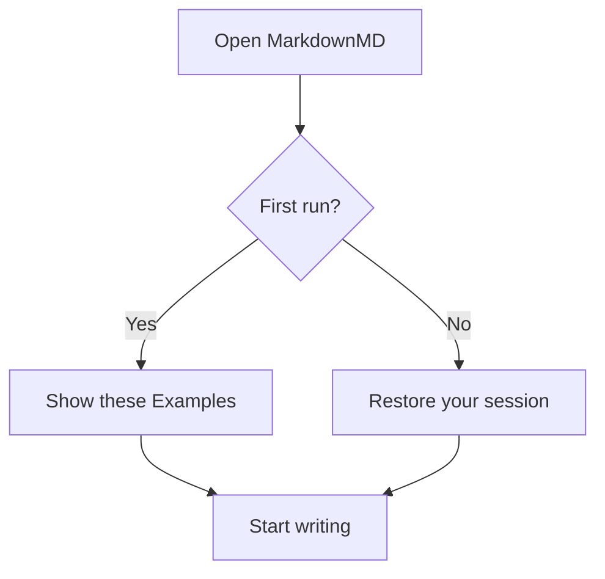
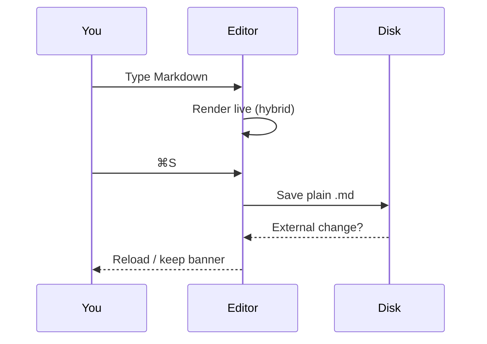
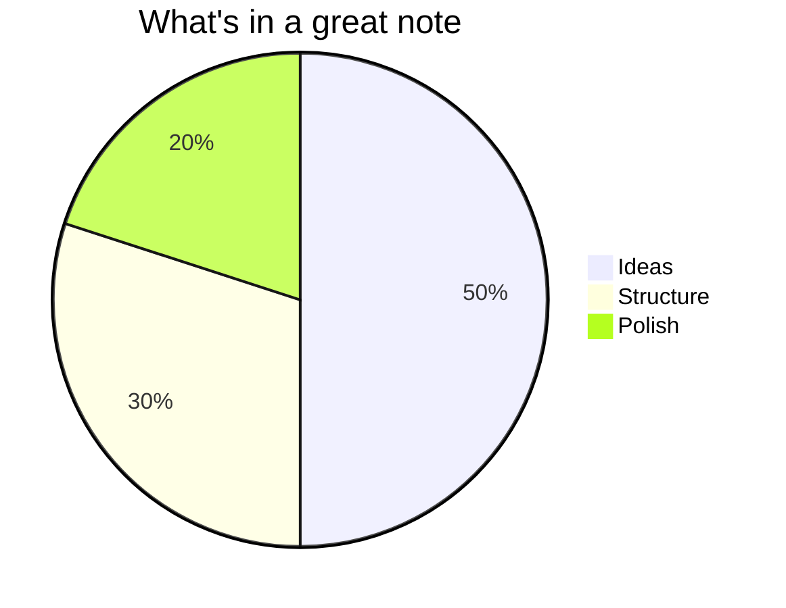

# Diagrams

Fence a code block with the `mermaid` language and it renders as a diagram.

## Flowchart

## Sequence diagram

## Pie chart

Edit the code in any normal (editable) document and the diagram updates as you type.
